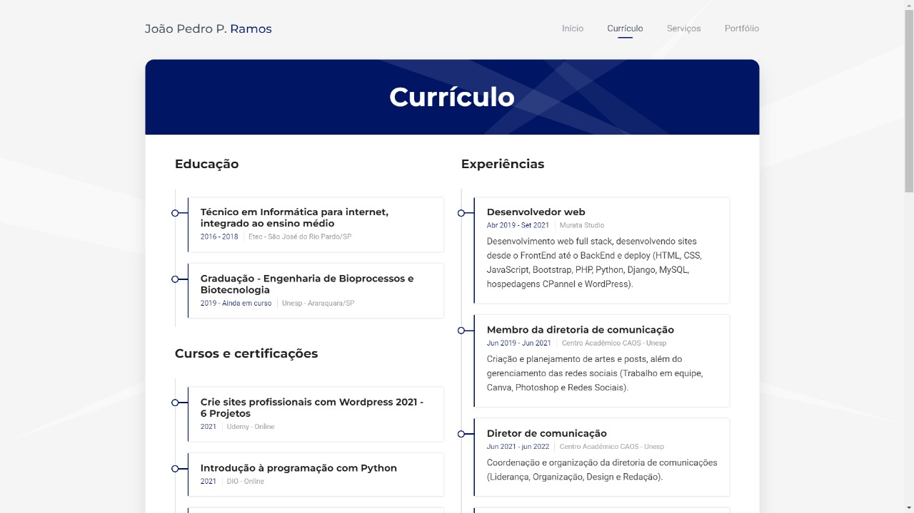
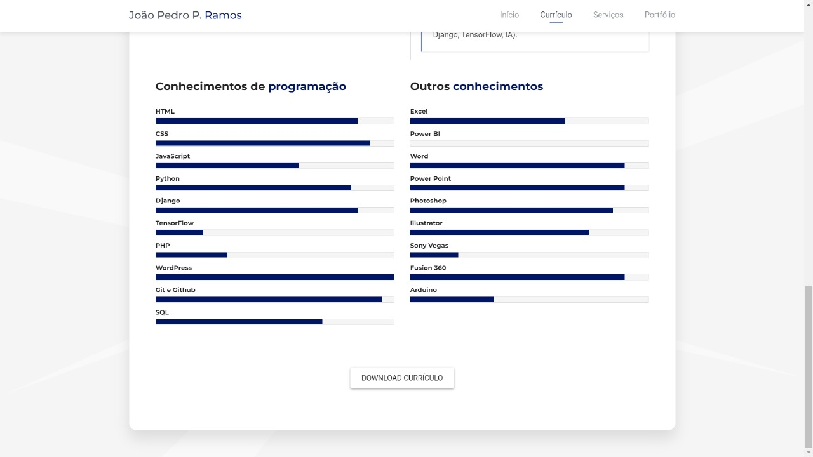
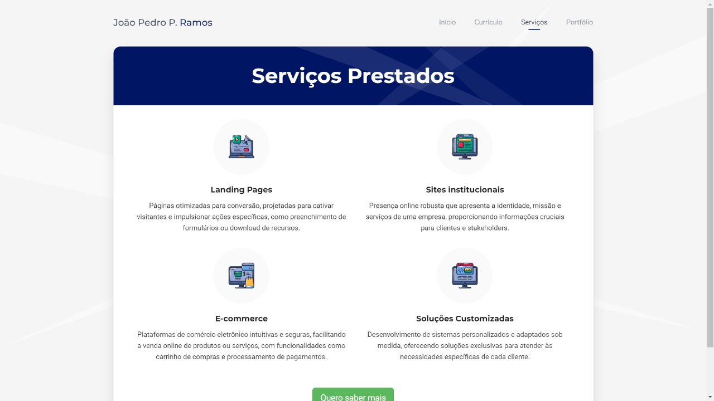

# Currículo online
> Este é um projeto que foi desenvolvido durante o curso "Git e GitHub Essencial para o Desenvolvedor" da Geek University.

Este projeto funciona como um currículo e portfólio online. Em sua essência é um site estático construído com HTML, CSS e Javascript. Conta com um design moderno, leve e bem interativo, levando o currículo e portfólio para um outro nível de profissionalismo.

O projeto conta com estruturas para foto, nome, profissão exercícida, redes sociais, resumo pessoal, dados pessoais, download de currículo em PDF, formações acadêmicas, experiências, certificados, quadro de habilidades, serviços prestados, depoimentos, indicações, e por fim um portifólio personalizado para imagens, vídeos e links externos.

## Como usar e personalizar o projeto

O primeiro passo é clonar o projeto no seu repositório local. Para isso você precisa ter o [Git](ref_git "Link para o site do Git") instalado no seu computador.

Após instalar o [Git](ref_git "Link para o site do Git") cria uma pasta no seu computador onde gostaria de clonar o proejto. Em seguida abra o terminal e navegue até essa pasta.

Com o terminal na pasta escolhida, digite:

```sh
git clone https://github.com/katiri/katiri.github.io.git .
```

Isso vai clonar os arquivos do projeto no diretório em que o terminal estiver aberto.

**Para personalizar o projeto** é necessário entender um pouco de HTML e CSS. No arquivo index.html será necessário trocar as minhas informações pelas suas. Na tela de perfil são necessárias apenas trocas de texto, nas demais telas é necessário fazer uma pequena manipulação nas estruturas HTML.

Para a adição, modificação ou exclusão de **imagens**, utiliza-se a pasta "images" e suas subpastas.

Para substituir o meu **currículo em PDF** pelo seu, troque o arquivo na pasta "cv".

Para alterar as **cores** do projeto, as configurações de estilização das cores estão no arquivo "main-green.css" na pasta "css".

**Após conluir a personalização** abra seu GitHub e crie um repositório como o nome "seu_usuario_github.github.io", isso vai fazer com que esse reposítório habilite a funcionalidade do GitHub Pages automaticamente.

No terminal do seu repositório local configure seu usuário:

```sh
git config user.name "seu_nome"
```

```sh
git config user.email "seu_email"
```

Depois disso troque o repositório remoto vinculado ao projeto com o seguinte comando:

```sh
git remote set-url origin https://github.com/seu_usuario_github/seu_usuario_github.github.io.git
```

Com as personalizações e essas configurações feitas você só precisa rodar os comandos a seguir para subir os arquivos para o repositório remoto:

```sh
git add .
```

```sh
git commit -m "Mensagem de sua preferência"
```

```sh
git push -u origin main
```

Serão solicitadas as suas credenciais para que você se conecte ao GitHub e depois disso estará tudo pronto.

Agora basta acessar seu_usuario_github.github.io no seu navegador e aproveitar seu currículo e portfólio online no GitHub Pages.

## Telas







## Meta
João Pedro P. Ramos - <jpedropazosramos@gmail.com> - [@LinkedIn](https://www.linkedin.com/in/joao-pedro-ramos "Meu LinkedIn")

<https://katiri.github.io/>


[ref_git]: https://git-scm.com/